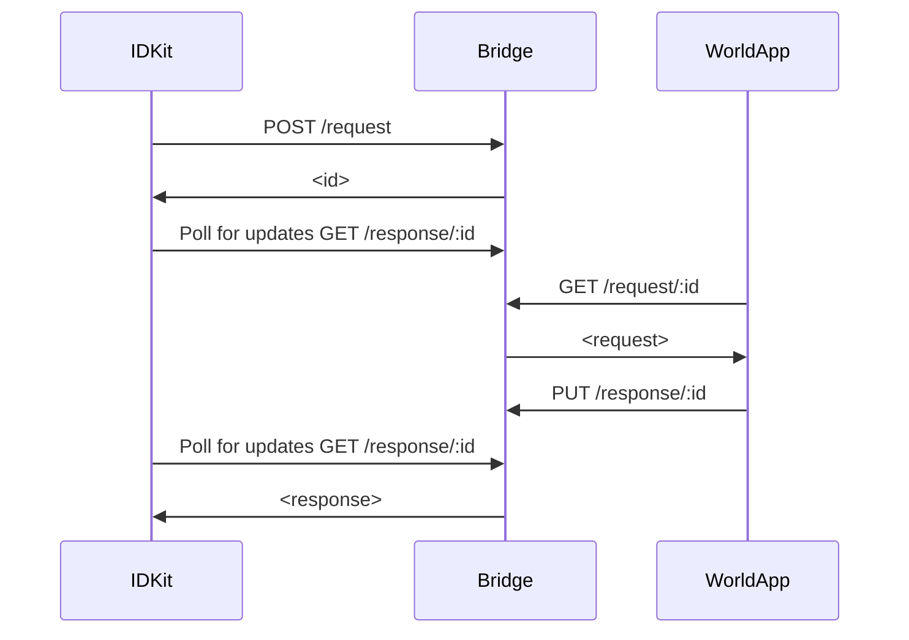
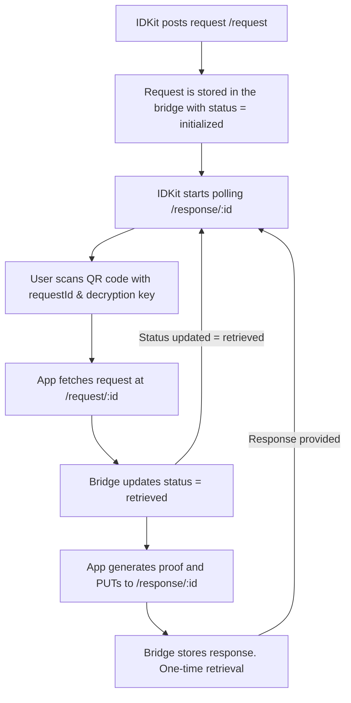

# Wallet Bridge

> **Warning** This project is still in early alpha.

An end-to-end encrypted bridge between the World ID SDK and World App. This bridge is used to pass zero-knowledge proofs for World ID verifications.

More details in the [docs](https://docs.worldcoin.org/further-reading/protocol-internals).

## Flow

## Endpoints

- `POST /request`: Called by IDKit. Initializes a proof verification request.
- `GET /request/:id`: Called by World App. Used to fetch the proof verification request. One time use.
- `PUT /response/:id`: Called by World App. Used to send the proof back to the application.
- `GET /response/:id`: Called by IDKit. Continuous pulling to fetch the status of the request and the response if available. Response can only be retrieved once.
