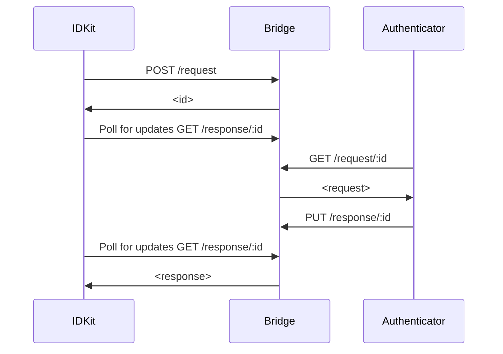
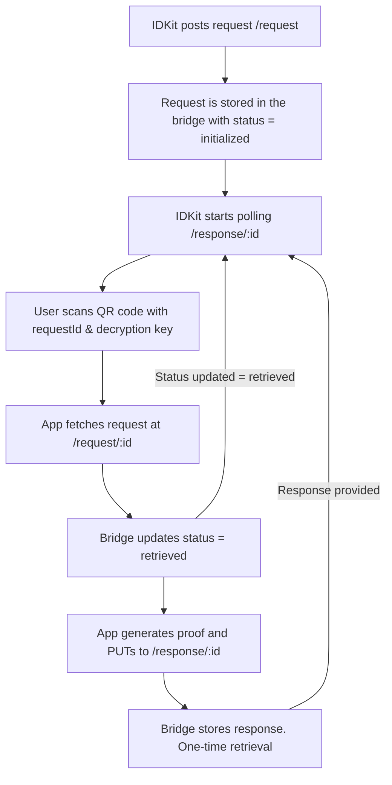
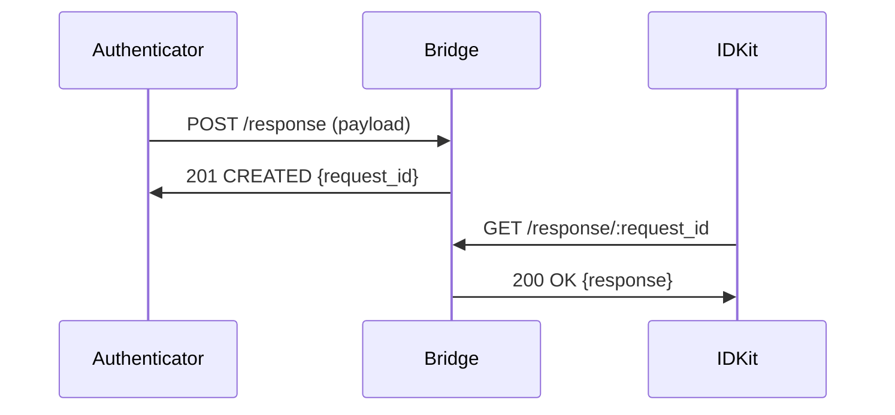

# Wallet Bridge

> **Warning** This project is still in early alpha.

An end-to-end encrypted bridge between the World ID SDK and World App. This bridge is used to pass zero-knowledge proofs for World ID verifications.

More details in the [docs](https://docs.world.org/world-id/further-reading/protocol-internals).

## Flow


```mermaid
sequenceDiagram
IDKit ->> Bridge: POST /request
Bridge ->> IDKit: <id>
IDKit ->> Bridge: Poll for updates GET /response/:id
Authenticator ->> Bridge: GET /request/:id
Bridge ->> Authenticator: <request>
Authenticator ->> Bridge: PUT /response/:id
IDKit ->> Bridge: Poll for updates GET /response/:id
Bridge ->> IDKit: <response>
```


```mermaid
flowchart
A[IDKit posts request /request] --> B[Request is stored in the bridge with status = initialized]
B --> C[IDKit starts polling /response/:id]
C --> D[User scans QR code with requestId & decryption key]
D --> E[App fetches request at /request/:id]
E --> F[Bridge updates status = retrieved]
F -- Status updated = retrieved --> C
F --> G[App generates proof and PUTs to /response/:id]
G --> H[Bridge stores response. One-time retrieval]
H -- Response provided --> C
```

## Endpoints

- `POST /request`: Called by IDKit. Initializes a proof verification request.
- `GET /request/:id`: Called by Authenticator. Used to fetch the proof verification request. One time use.
- `PUT /response/:id`: Called by Authenticator. Used to send the proof back to the application.
- `GET /response/:id`: Called by IDKit. Continuous pulling to fetch the status of the request and the response if available. Response can only be retrieved once.
- `POST /response`: Called by Authenticator. Creates a standalone response without a prior request.

### Standalone Response Flow (Authenticator Initiates)

Authenticator App initiates without a prior IDKit request:


```mermaid
sequenceDiagram
    participant Authenticator
    participant Bridge
    participant IDKit

    Authenticator->>Bridge: POST /response (payload)
    Bridge->>Authenticator: 201 CREATED {request_id}
    IDKit->>Bridge: GET /response/:request_id
    Bridge->>IDKit: 200 OK {response}
```

**World App workflow:**
1. POST /response with encrypted payload
2. Receive generated request_id
3. Send request_id to IDKit
4. IDKit retrieves response using GET /response/:request_id

**TTL:** 15 minutes (900 seconds) - responses expire automatically

## Local Development

An easy way to run is using a Dockerized Redis:

```
docker run -d -p 6379:6379 redis
```

When building the Dockerfile locally remember to specify the `--platform=linux/amd64` flag.

## Testing

### Integration Testing

A `docker-compose.test.yml` file provides Redis for integration testing, and comprehensive integration tests are available in the `tests/` directory.

#### Running Integration Tests

```bash
# Terminal 1: Start Redis
docker-compose -f docker-compose.test.yml up -d

# Terminal 2: Start the application
REDIS_URL=redis://localhost:6379 cargo run

# Terminal 3: Run the tests
cargo test --test integration_test
```

For more details, see [tests/README.md](tests/README.md).

#### What's Tested

The integration tests cover:
- Request creation and retrieval (one-time use)
- Response submission and retrieval
- Standalone response flow (World App initiated)
- Pending status handling
- Error cases (404s, validation)
- OpenAPI documentation endpoint

### Manual Integration Testing

#### Test Request Flow

```bash
# Create a request
REQUEST_ID=$(curl -s -X POST http://localhost:8000/request \
  -H "Content-Type: application/json" \
  -d '{"iv":"test_iv","payload":"test_payload"}' | jq -r '.request_id')

# Verify request exists
curl -I http://localhost:8000/request/$REQUEST_ID

# Retrieve request (one-time use)
curl http://localhost:8000/request/$REQUEST_ID

# Verify request was deleted (should return 404)
curl http://localhost:8000/request/$REQUEST_ID
```

#### Test Response Flow

```bash
# Create a request
REQUEST_ID=$(curl -s -X POST http://localhost:8000/request \
  -H "Content-Type: application/json" \
  -d '{"iv":"test","payload":"test"}' | jq -r '.request_id')

# Submit a response
curl -X PUT http://localhost:8000/response/$REQUEST_ID \
  -H "Content-Type: application/json" \
  -d '{"iv":"response","payload":"response"}'

# Retrieve the response
curl http://localhost:8000/response/$REQUEST_ID
```

#### Test Standalone Response Flow

```bash
# Create standalone response (Authenticator initiated)
RESPONSE_ID=$(curl -s -X POST http://localhost:8000/response \
  -H "Content-Type: application/json" \
  -d '{"iv":"standalone","payload":"standalone"}' | jq -r '.request_id')

# Retrieve the response
curl http://localhost:8000/response/$RESPONSE_ID
```

Other useful environment variables:
- `PORT`: Application port (default: 8000)
- `ENVIRONMENT`: Environment name (development/production)
- `RUST_LOG`: Logging level (info/debug/trace)