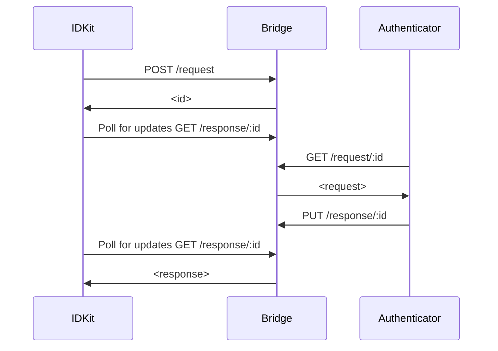
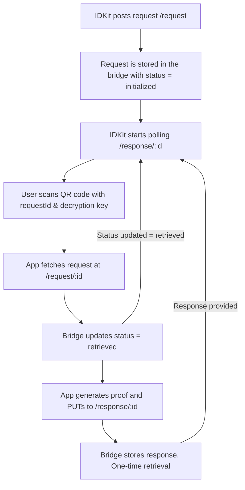
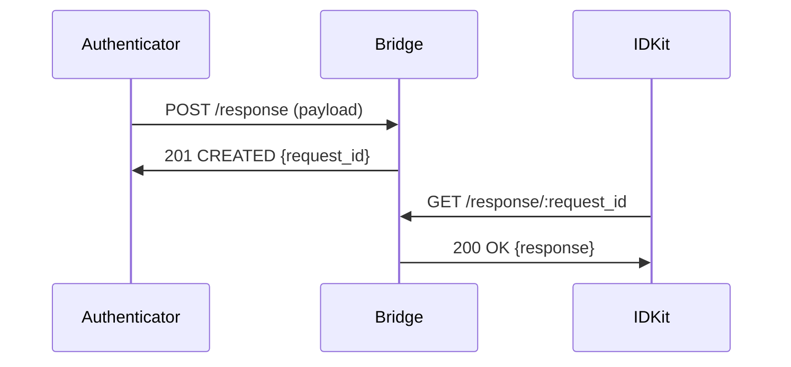

# Wallet Bridge

> **Warning** This project is still in early alpha.

An end-to-end encrypted bridge between the World ID SDK and World App. This bridge is used to pass zero-knowledge proofs for World ID verifications.

More details in the [docs](https://docs.world.org/world-id/further-reading/protocol-internals).

## Flow


```mermaid
sequenceDiagram
IDKit ->> Bridge: POST /request
Bridge ->> IDKit: <id>
IDKit ->> Bridge: Poll for updates GET /response/:id
Authenticator ->> Bridge: GET /request/:id
Bridge ->> Authenticator: <request>
Authenticator ->> Bridge: PUT /response/:id
IDKit ->> Bridge: Poll for updates GET /response/:id
Bridge ->> IDKit: <response>
```


```mermaid
flowchart
A[IDKit posts request /request] --> B[Request is stored in the bridge with status = initialized]
B --> C[IDKit starts polling /response/:id]
C --> D[User scans QR code with requestId & decryption key]
D --> E[App fetches request at /request/:id]
E --> F[Bridge updates status = retrieved]
F -- Status updated = retrieved --> C
F --> G[App generates proof and PUTs to /response/:id]
G --> H[Bridge stores response. One-time retrieval]
H -- Response provided --> C
```

## Endpoints

- `POST /request`: Called by IDKit. Initializes a proof verification request.
- `GET /request/:id`: Called by Authenticator. Used to fetch the proof verification request. One time use.
- `PUT /response/:id`: Called by Authenticator. Used to send the proof back to the application.
- `GET /response/:id`: Called by IDKit. Continuous pulling to fetch the status of the request and the response if available. Response can only be retrieved once.
- `POST /response`: Called by Authenticator. Creates a standalone response without a prior request.

### Standalone Response Flow (Authenticator Initiates)

Authenticator App initiates without a prior IDKit request:


```mermaid
sequenceDiagram
    participant Authenticator
    participant Bridge
    participant IDKit

    Authenticator->>Bridge: POST /response (payload)
    Bridge->>Authenticator: 201 CREATED {request_id}
    IDKit->>Bridge: GET /response/:request_id
    Bridge->>IDKit: 200 OK {response}
```

**World App workflow:**
1. POST /response with encrypted payload
2. Receive generated request_id
3. Send request_id to IDKit
4. IDKit retrieves response using GET /response/:request_id

**TTL:** 15 minutes (900 seconds) - responses expire automatically

## Local Development

An easy way to run is using a Dockerized Redis:

```
docker run -d -p 6379:6379 redis
```

When building the Dockerfile locally remember to specify the `--platform=linux/amd64` flag.