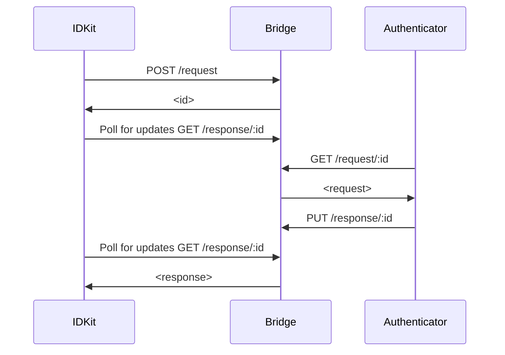
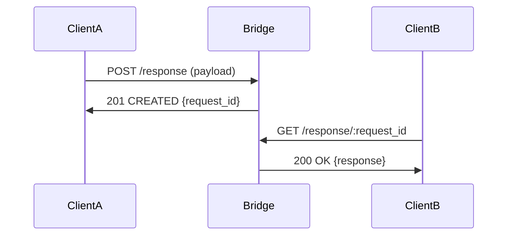

# Message Bridge (previously Wallet Bridge)

The message bridge is a **dumb**, environment and client agnostic relay of arbitrary messages. It lets two parties share an arbitrary message where parties can gossip a 
symmetric key off-band.

The bridge is made so that it cannot eavesdrop on any messages. The bridge expects only ciphertext. **All clients MUST encrypt all payloads before submitting to the bridge.**.

- **Importantly** this bridge is completely agnostic to any client or environment, it simply relays messages, hence it implements no logic or opinions related to client handling.
- All messages received by this bridge are temporarily held for delivery, but are automatically purged after a period of time. This service has and SHOULD NOT have _persisting_ storage.

## Use Case: World ID Protocol

The bridge is currently used in the [World ID Protocol](https://github.com/worldcoin/world-id-protocol). The most used path is for RPs to request proofs from users (to their Authenticators) and for Authenticators to send back proofs.

### Example Flow


```mermaid
sequenceDiagram
IDKit ->> Bridge: POST /request
Bridge ->> IDKit: <id>
IDKit ->> Bridge: Poll for updates GET /response/:id
Authenticator ->> Bridge: GET /request/:id
Bridge ->> Authenticator: <request>
Authenticator ->> Bridge: PUT /response/:id
IDKit ->> Bridge: Poll for updates GET /response/:id
Bridge ->> IDKit: <response>
```

### Endpoints

- `POST /request`: Called by IDKit. Initializes a proof verification request.
- `GET /request/:id`: Called by Authenticator. Used to fetch the proof verification request. One time use.
- `HEAD /request/:id`: Existence check for a request. `200` if present, `404` otherwise.
- `PUT /response/:id`: Called by Authenticator. Used to send the proof back to the application.
- `GET /response/:id`: Called by IDKit. Continuous pulling to fetch the status of the request and the response if available. Response can only be retrieved once.
- `HEAD /response/:id`: Existence check for a request's status. `200` if present, `404` otherwise.
- `POST /response`: Called by a client to create a standalone response without a prior request (see [Standalone Response Flow](#standalone-response-flow)).
- `PUT /request/:id`: Staging only (`ENVIRONMENT == "staging"`). Idempotent request upsert.

### Standalone Response Flow

This flow allows a client to send a `/response` without first generating a `/request` first.


```mermaid
sequenceDiagram
    participant ClientA
    participant Bridge
    participant ClientB

    ClientA->>Bridge: POST /response (payload)
    Bridge->>ClientA: 201 CREATED {request_id}
    ClientB->>Bridge: GET /response/:request_id
    Bridge->>ClientB: 200 OK {response}
```

## Local Development

An easy way to run is using a Dockerized Redis:

```
docker run -d -p 6379:6379 redis
```

When building the Dockerfile locally remember to specify the `--platform=linux/amd64` flag.

## Testing

Integration tests build the bridge in-process and drive it directly, so the only external dependency is Redis (override its location with `REDIS_URL`):

```bash
docker-compose -f docker-compose.test.yml up -d
cargo test
```

## bridge-cli

Install the Rust CLI from this checkout with `cargo install --path . --bin bridge-cli --locked`,
or run it with `cargo run --bin bridge-cli -- --help`. Plain `cargo run` still starts the server.

The CLI sends **already-encrypted** JSON envelopes containing exactly two string fields:
`iv` and `payload`. It does not encrypt or decrypt messages. Supply an envelope file with
`--input ciphertext.json`, or pipe it through stdin (the default, also `--input -`).

```bash
# Create a request; stdout contains {"request_id":"..."}.
bridge-cli create request --input ciphertext.json
# Optionally choose a high-entropy ID with --id.
bridge-cli create request --input ciphertext.json --id "$REQUEST_ID"

# Check without consuming, then retrieve once.
bridge-cli head request "$REQUEST_ID"
bridge-cli get request "$REQUEST_ID"

# Submit a response, then fetch its status and any available ciphertext.
bridge-cli respond "$REQUEST_ID" --input encrypted-response.json
bridge-cli get response "$REQUEST_ID"

# Create a standalone response without a prior request.
bridge-cli create response --input encrypted-response.json
bridge-cli head response "$REQUEST_ID"
```

Set `BRIDGE_URL` or pass `--url https://your-bridge.example` (default:
`http://127.0.0.1:8000`). URL path prefixes are supported. `--timeout` sets a positive
HTTP timeout in seconds (default: 30). Redirects and automatic retries are disabled.

Successful response bodies go to stdout unchanged, followed by a newline; empty bodies
produce no output. `head` prints the HTTP status code. Errors go to stderr and exit
nonzero (including HTTP 404); argument errors exit 2. Successful commands exit 0.
`get response` returns the server's pending status immediately when no response exists yet.
**GET consumes any available message**, so avoid running it merely to inspect existence.
The CLI does not expose the staging-only request upsert or app-specific capabilities.

CLI HTTP tests use a local mock server and need no Redis:
`cargo test --test bridge_cli`.
