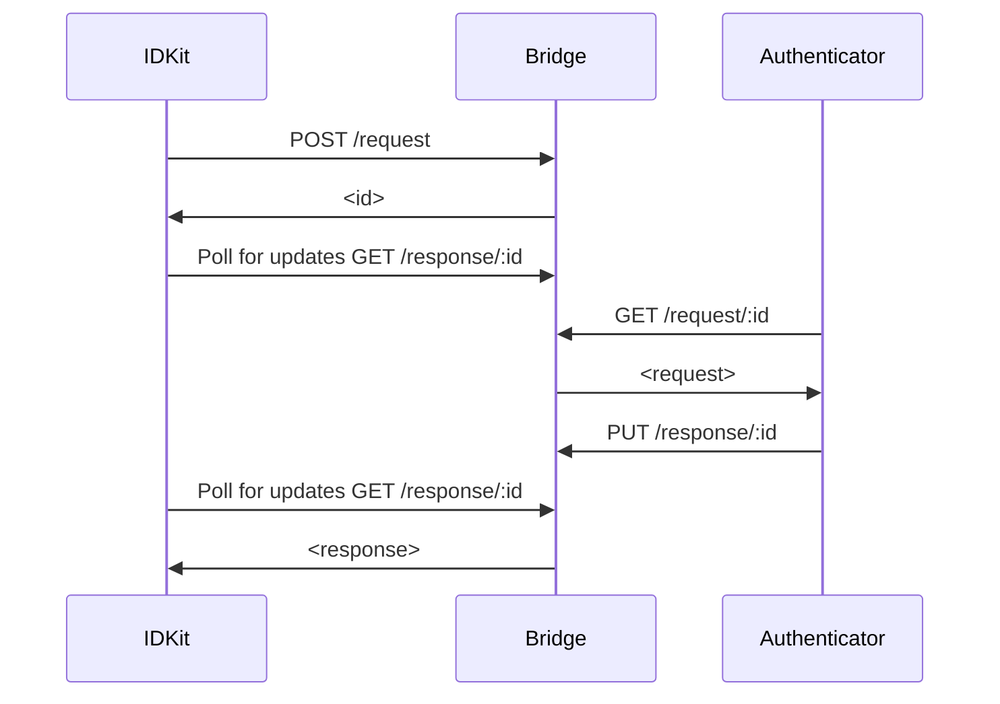
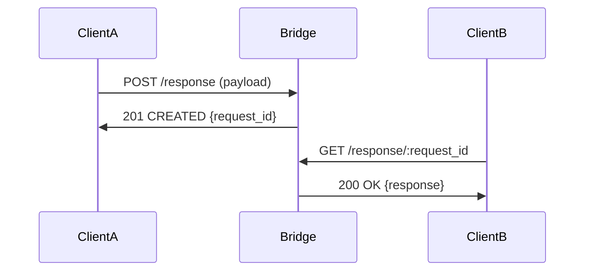

# Message Bridge (previously Wallet Bridge)

The message bridge is a **dumb**, environment and client agnostic relay of arbitrary messages. It lets two parties share an arbitrary message where parties can gossip a 
symmetric key off-band.

The bridge is made so that it cannot eavesdrop on any messages. The bridge expects only ciphertext. **All clients MUST encrypt all payloads before submitting to the bridge.**.

- **Importantly** this bridge is completely agnostic to any client or environment, it simply relays messages, hence it implements no logic or opinions related to client handling.
- All messages received by this bridge are temporarily held for delivery, but are automatically purged after a period of time. This service has and SHOULD NOT have _persisting_ storage.

## Use Case: World ID Protocol

The bridge is currently used in the [World ID Protocol](https://github.com/worldcoin/world-id-protocol). The most used path is for RPs to request proofs from users (to their Authenticators) and for Authenticators to send back proofs.

### Example Flow


```mermaid
sequenceDiagram
IDKit ->> Bridge: POST /request
Bridge ->> IDKit: <id>
IDKit ->> Bridge: Poll for updates GET /response/:id
Authenticator ->> Bridge: GET /request/:id
Bridge ->> Authenticator: <request>
Authenticator ->> Bridge: PUT /response/:id
IDKit ->> Bridge: Poll for updates GET /response/:id
Bridge ->> IDKit: <response>
```

### Endpoints

- `POST /request`: Called by IDKit. Initializes a proof verification request.
- `GET /request/:id`: Called by Authenticator. Used to fetch the proof verification request. One time use.
- `HEAD /request/:id`: Existence check for a request. `200` if present, `404` otherwise.
- `PUT /response/:id`: Called by Authenticator. Used to send the proof back to the application.
- `GET /response/:id`: Called by IDKit. Continuous pulling to fetch the status of the request and the response if available. Response can only be retrieved once.
- `HEAD /response/:id`: Existence check for a request's status. `200` if present, `404` otherwise.
- `POST /response`: Called by a client to create a standalone response without a prior request (see [Standalone Response Flow](#standalone-response-flow)).
- `PUT /request/:id`: Staging only (`ENVIRONMENT == "staging"`). Idempotent request upsert.

### Standalone Response Flow

This flow allows a client to send a `/response` without first generating a `/request` first.


```mermaid
sequenceDiagram
    participant ClientA
    participant Bridge
    participant ClientB

    ClientA->>Bridge: POST /response (payload)
    Bridge->>ClientA: 201 CREATED {request_id}
    ClientB->>Bridge: GET /response/:request_id
    Bridge->>ClientB: 200 OK {response}
```

## Local Development

An easy way to run is using a Dockerized Redis:

```
docker run -d -p 6379:6379 redis
```

When building the Dockerfile locally remember to specify the `--platform=linux/amd64` flag.

## Testing

Integration tests build the bridge in-process and drive it directly, so the only external dependency is Redis (override its location with `REDIS_URL`):

```bash
docker-compose -f docker-compose.test.yml up -d
cargo test
```

## bridge-cli

Install with `cargo install --path . --bin bridge-cli --locked`, or run
`cargo run --bin bridge-cli -- --help`. Plain `cargo run` starts the server.

### Send a message or file

```bash
bridge-cli send --message 'Hello from my terminal'
bridge-cli send --input message.json
cat message.json | bridge-cli send
```

`send` encrypts the input locally and creates a request. It prints JSON containing
`request_id`, `key`, and `bridge_url`. Share these connection details with the respondent
through a trusted channel: the key is secret and is never sent to the bridge.
An optional `--key` (or `BRIDGE_KEY`) reuses an existing base64-encoded 32-byte key.
Otherwise the CLI generates a fresh AES-256 key.

### Receive and reply

Use the ID and key returned by `send`, with the same bridge URL on both sides:

```bash
export BRIDGE_KEY='<key from send>'
REQUEST_ID='<request_id from send>'

# Respondent: decrypt the request to stdout, then send an encrypted reply.
bridge-cli receive request "$REQUEST_ID"
bridge-cli reply "$REQUEST_ID" --message 'Message received'
# Or: bridge-cli reply "$REQUEST_ID" --input reply.json

# Sender: decrypt the reply to stdout.
bridge-cli receive response "$REQUEST_ID"
```

Plaintext can be any bytes, including a JSON document; the CLI preserves file/stdin
contents and writes decrypted bytes without adding a newline. Both `send` and `reply`
accept `--message`, `--input FILE`, or stdin (default, also `--input -`). Inline messages
and keys may appear in shell history; file/stdin and `BRIDGE_KEY` avoid literal shell arguments.

Encryption matches the existing bridge client envelope: AES-256-GCM, a fresh random
12-byte IV per message, no associated data, and standard base64 `iv` and `payload`
fields. The payload includes the 16-byte authentication tag. The server remains an
opaque relay; encryption and decryption happen only in the CLI.

### Deployment and single-use behavior

The default is **staging**, `https://staging-bridge.worldcoin.org`.
Use `--url https://bridge.worldcoin.org` for production, or set `BRIDGE_URL`.
An explicit `--url` overrides the environment variable. Custom URLs and path prefixes
are supported; use `--url http://127.0.0.1:8000` for local development.
`--timeout` sets a positive HTTP timeout in seconds (default: 30).
Redirects and automatic retries are disabled.

**Receiving consumes the message**, even if you supply the wrong key. Check existence
without consuming using `bridge-cli head request "$REQUEST_ID"` or `head response`.
If a response is pending, `receive response` reports that on stderr and exits nonzero;
run it again when the respondent has replied. Messages expire according to the bridge TTL
(currently 15 minutes). The CLI does not save keys or messages automatically.

### Low-level commands

For already-encrypted envelopes with exactly string `iv` and `payload` fields:

```bash
bridge-cli create request --input ciphertext.json
bridge-cli create request --input ciphertext.json --id "$REQUEST_ID"
bridge-cli create response --input ciphertext.json
bridge-cli get request "$REQUEST_ID"
bridge-cli get response "$REQUEST_ID"
bridge-cli respond "$REQUEST_ID" --input ciphertext.json
```

These return raw server bodies followed by a newline; empty bodies produce no output.
`head` prints the HTTP status code. Errors go to stderr and exit nonzero, argument errors
exit 2, and success exits 0. Low-level `get response` prints pending status as returned
by the server. The CLI does not expose staging-only request upsert or app-specific capabilities.

CLI HTTP tests use local mock servers and need no Redis: `cargo test --test bridge_cli`.
